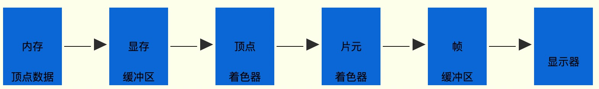

# 代码执行流程简述

  执行 initShader 函数后，会返回一个程序program对象，同时顶点着色器的位置变量apos会 与program建立联系，你可以把apos理解为对象program的属性
  
  通过getAttribLocation()方法使当前定义的变量aposLocation指向apos变量，方法的第一个参数是对象program，第二个参数是顶点着色器位置变量apos，并使用引号标识。
  
  data 定义的是矩形四个顶点的顶点坐标，仅定义了x和y轴坐标，8个元素存入数组，z轴坐标未定义，z轴方向垂直屏幕，如果图形没有旋转平面显示不受z影响。 当浏览器运行这句代码时，会在 <b>内存</b> 上开辟一个区域，初始化语句重定义的矩形顶点数据。

  创建 buffer 到 enableVertexAttribArray 部分代码的作用总体上是把内存中顶点数据输入显存，这样可以提高图形的处理效率。
  
  ```js
  gl.vertexAttribPointer(aposLocation, 2, gl.FLOAT, false, 0, 0);
  ```

  该语句的第二个参数2表达的意思是 2 个数组为一组， 8个元素也就是总共四组，逐组传递给apos变量，可以知道apos是vec4类型数据，也就是有四个参数的向量，这样的话缺少两个数值元素， 这种情况下，一般第三个代表z轴的坐标值默认为0，第四个参数默认为1，数据逐组传递的过程就蕴含着GPU渲染管线逐顶点处理数据的概念。

  drawArrays 相当于最后的发令枪，命令GPU开始逐顶点处理数据，并安装一定的方式处理顶点，生成最终像素数据，第一个参数(mode)控制的是如何根据点生成像素。

# drawArrays整体执行顺序


- 顶点着色器执行main函数中语句gl_Position =apos;，逐顶点获得顶点坐标数据，有四个点意味着赋值执行四次，这个过程就是逐顶点
- 顶点数据获得后，会进行图元装配，起作用的就是drawArrays方法的第一个参数绘制模式mode，然后光栅化得到的就是片元framgment，你可把片元理解成还没有定义颜色的显示器相应位置的像素rgb值，尽管这么理解不完美
- 光栅化后得到片元数据，片元着色器会执行main函数中语句gl_FragColor = vec4(1.0,0.0,0.0,1.0);，每一个片元依次添加颜色，这里定义的是红色，处理过程就是逐片元处理。
- 处理后获得的像素颜色数据可能还要经过一些环节，为了简化问题，你暂时可以理解为这些片元处理后得到的一系列像素数据都存储在显卡的帧缓冲区中，你可简单理解为一张图片是一帧，显示器会按照一定的频率扫描并显示这些数据， 界面刷新频率60HZ最常见，人的眼睛有视觉暂留效应，只要刷新频率不太低，就不会感觉到卡顿，有些视频单位时间内播放的帧数太少，大家会感到很不流畅。

[GPU 渲染管线相关知识](https://zhuanlan.zhihu.com/p/137780634)

# 硬件相关

  着色器语言编写得程序成为着色器程序(shader program),在顶点着色器上执行的是顶点着色器程序 在片元着色器上执行的是片元着色器程序
  可编程顶点处理器(Programmable Vertex Processor)又称为顶点着色器，用来执行顶点着色器程序
  可编程片元处理器(Programmable Fragment Processor)又称为片元着色器，用来执行片元着色器程序

  GPU中有各种专门的寄存器，比如用来接收顶点坐标数据的寄存器是输入寄存器，从数据类型的角度看属于浮点寄存器，用来临时存储浮点数； 存储输出到显示器像素的帧缓存是输出寄存器，从处理速度的角度看是数据缓冲寄存器，GPU处理数据的速度要比显示器扫描帧缓存中像素数据的速度要快得多
  
  显示器像素是显示器可以通过RGB值控制的最小单位，一幅图像是由大量像素点累积显示。着色器中的颜色定义会反映在显示器中
  显示器的分辨率就是显示器长度方向像素点的个数X显示器宽度方向像素点的个数
  屏幕相邻的两个像素单元的距离就是点距，点距越小显示效果越好，一般现在显示器0.2mm~0.4mm之间
