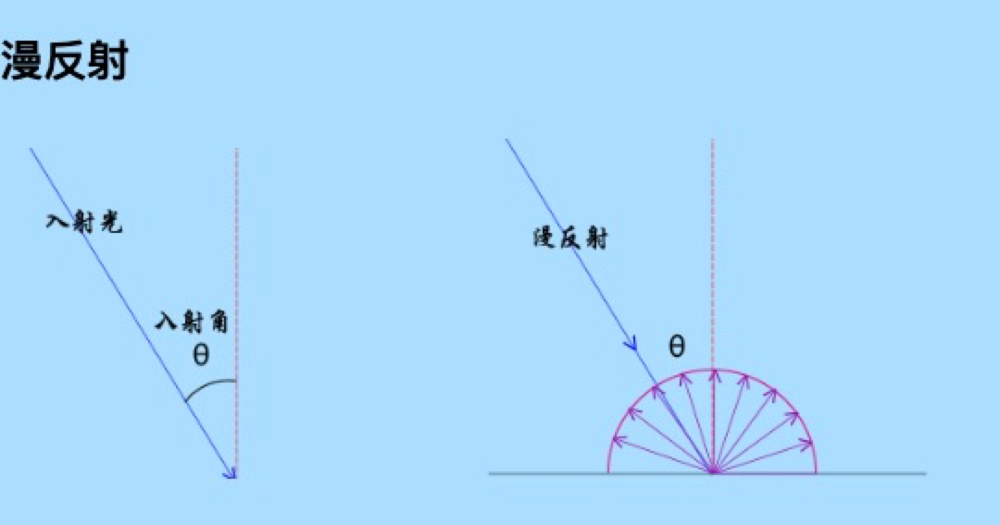
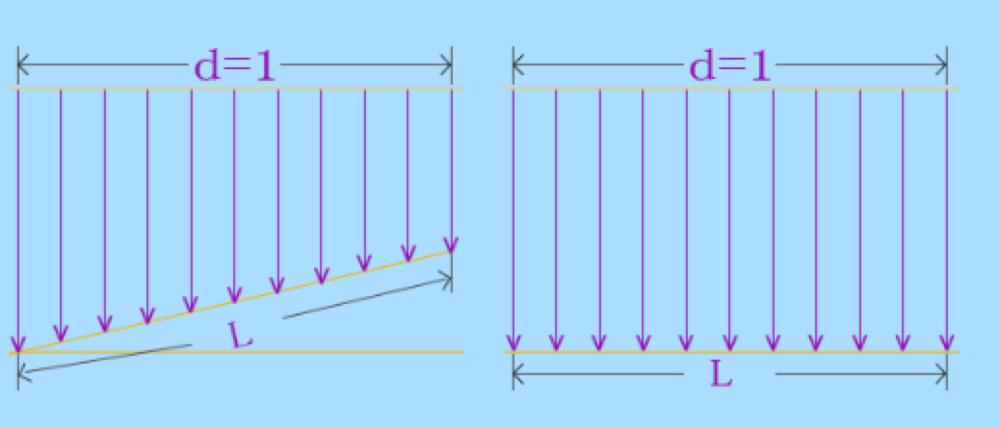
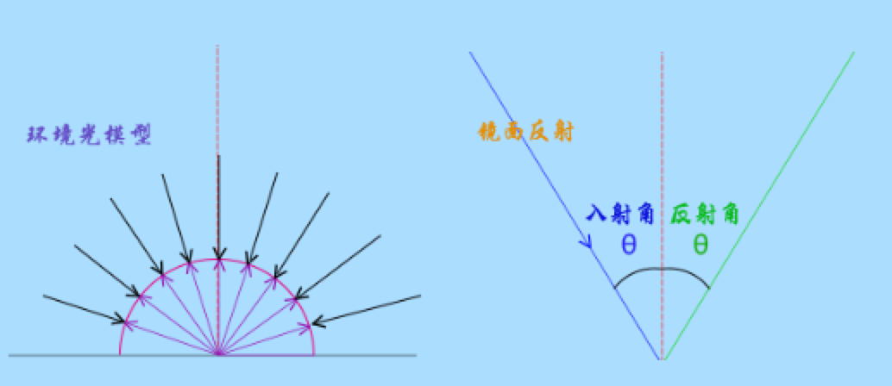
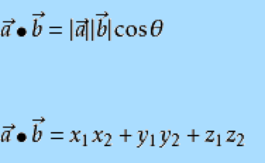

# 漫反射


<b style="color: blue">漫反射光的颜色 = 几何体表面基色 x 光线颜色 x 光线入射角余弦值</b>
这个数学模型没有考虑镜面反射描述的就是理想的漫反射体，并不能完整的描述物体表面的光场，既然是数学模型，自然就是可以修正的，比如添加一个系数，更改指数等等，这里不在详述。

比如普通的桌子桌面它的粗糙度是微米um级，相比人的脸它是平的，光的波长是纳米nm级，这时候桌子表面相比光线是凹凸不平的，宏观来看一束光线照射到物体的表面，对于理想的漫反射而言，因为表面无规则随机分布凹凸不平的反射面， 光线的反射是不定向的，换句话说任何角度的反射光都是一样的，这也就是说物体反射到眼睛中的光与人的观察位置无关，物体的漫反射光强度与光线的入射角有关如何解释，这个其实很简单，比如两块纸板面积相同，一个垂直太阳光线放置， 一个不垂直太阳光线也就是入射角不是90度，同样强度的光照条件下，垂直太阳光的纸板的光通量肯定比斜着放的纸板接收的光量大，这时候就有必要给数学模型引入一个入射角的因数。


光的颜色可以使用多种模型来表示，把上面的文字公式使用RGB具体参数来表示形式如下，比如物体表面的颜色是纯红色(1,0,0),入射光是纯白色(1,1,1),光线入射角是60度，余弦值就是0.5，代入下面公式，可以得出结果是(0.5,0,0), 结果仍然是红色，这是符合实际生活的，白色太阳光照在常见的红色物体上，反射的颜色是红色，只是太阳光线照射在物体表面的角度不同，反射的光强度不同。入射光垂直物体表面，也就是入射角是0对应的余弦值是1，光线垂直表面受光量最大， 反射光自然最大，和1对应；入射光线平行物体表面，此时的入射角是90度， 物体表面自然没什么光可以反射，
<b style="color: blue">(R2,G2,B2) = (R1,G1,B1) x (R0,G0,B0) x cosθ</b>

# 镜面反射


上面的漫反射数学模型没有考虑镜面反射，描述的就是理想的漫反射体，并不能完整的描述物体表面的光场。漫反射是因为几何体表面粗糙度尺寸相对光波长尺寸而言是凹凸不平的，这种凹凸不平又是随机的，所以说漫反射的光线各个方向是均匀的。
镜面反射也就是说光照在物体上的反射光线具有方向性，具体点说就是光线的反射角等于入射角。生活中的镜子它的表面粗糙度很小，和光的波长是一个数量级，当光线照在上面的时候，反射光线就会表现出方向性。

实际的生活中所有的物体没有绝对的漫反射或者镜面反射，往往都是同时存在，只是表现的倾向性不同，镜子的镜面反射更明显，粗糙的树皮漫反射更明显。光照射到物体上一部分会被吸收，透明的话一部分会被折射， 除去吸收和折射的光剩余的会被反射，反射的时候根据表面的粗糙度不同，镜面反射和漫反射分配的比例不同可以使用两个系数k1、k2去描述。

<b style="color: blue">镜面反射光的颜色 = 几何体表面基色 x 光线颜色 x 视线与反射光线的夹角余弦值n</b>

# 环境光照

在暗的环境下，物体比较暗，光亮的环境下，物体比较光亮，描述这个现象可以使用环境光照模型。光线在自然环境中会在不同的物体之间来回反射，单束的光线具有方向性，所有方向的光线随机分布，形成一个没有特殊的光线方向的的环境光照。 多数情况下室内室外环境光颜色通常都是RGB相同的白色到黑色之间的值，(1,1,1)表示最强的环境光照颜色，(0,0,0)相当于处于完全的没有光照的黑色环境中。

<b style="color: blue">环境反射光颜色 = 几何体表面基色 x 环境光颜色</b>

# 复合光照

使用光照渲染模型的时候往往会使用多种光照模型，然后把每个光照模型颜色相乘的结果RGB分别相加，这时候要注意，多种模型的光照颜色相加后RGB的值要保证在区间[0,1]，因为WebGL的RGB颜色模型默认RGB分量的最大值是1，注意分配比例即可。

<b style="color: blue">总反射光线 = 漫反射光线 + 镜面反射光线 + 环境反射光线</b>

# 法向量

有基本的数学知识应该都有法线的概念，垂直与面的直线就是面的法线，对于平面而言面上所有位置的法线方向是相同的，对于曲面而言不同的位置法线的方向是变化的。在三维笛卡尔坐标系中，可以使用向量(x,y,z)来表示法向量，根据几何体表面的法向量和光线的方向， 就可以求解出光线入射角的余弦值，法向量的点积计算满足下面的公式，为了方便计算，着色器语言内置了一个方法dot()用来求解两个向量之间的余弦值,已知向量a1(x1,y1,z1)、a2(x2，y2，z2)执行dot(a1，a2)可以求出两个向量a1、a2的余弦值。


# 顶点着色器：添加变量

- attribute
    声明的变量往往与顶点数据相关，比如顶点位置坐标、顶点颜色值和顶点法向量数据。
    attribute关键字声明的顶点变量而且可以通过方法getAttribLocation()获取顶点数据的索引位置， 然后利用方法vertexAttribPointer()可以把类型数组创建的顶点数据传递给顶点着色器，然后逐顶点处理计算。
- uniform
    uniform关键字和attribute共同的作用是可以接收数据，不同点是接收的数据不同。
    uniform关键字声明的数据不是顶点数据，这些数据往往都会重复利用，每个顶点进行计算的时候都会用到，比如光线颜色、光线方向、光线位置、模型变换矩阵。
- varying
    varying关键字在颜色插值计算中往往会使用，每个顶点的颜色与法向量进行乘法运算后，进行赋值计算，等于告诉渲染管线离散的顶点颜色进行插值计算，去填充顶点之间的片元像素值， 为了完整实现这一点，需要在片元着色器代码中同样使用关键字varying再次声明该变量，这样的话插值后的颜色值会地递给片元着色器。

# 顶点着色器：光照计算

dot()是着色器语言内置的一个函数方法，它的参数是两个向量，执行结果是两个向量的点积。
如果光线方向向量和顶点法向量两个向量都是单位向量，求解的结果就是平行光线与物体表面法线夹角的余弦值。

```js
// 顶点法向量归一化
vec3 normal = normalize(a_normal.xyz);
// 计算平行光方向向量和顶点法向量的点积
float dot = max(dot(u_lightDirection, normal), 0.0);
// 计算平行光方向向量和顶点法向量的点积
vec3 reflectedLight = u_lightColor * a_color.rgb * dot;
//颜色插值计算
v_color = vec4(reflectedLight, a_color.a);
```

